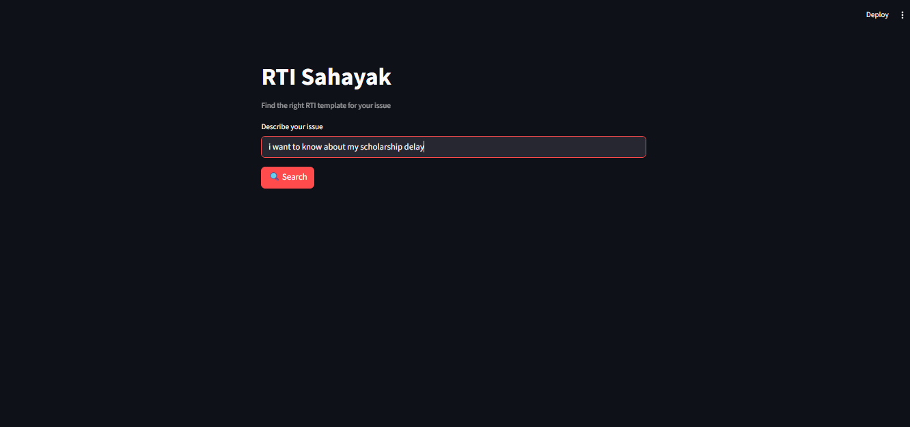
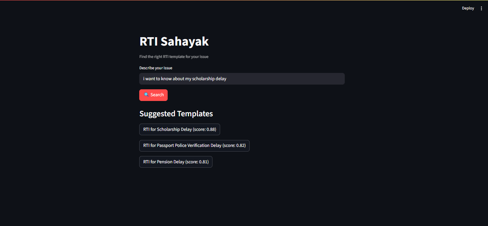
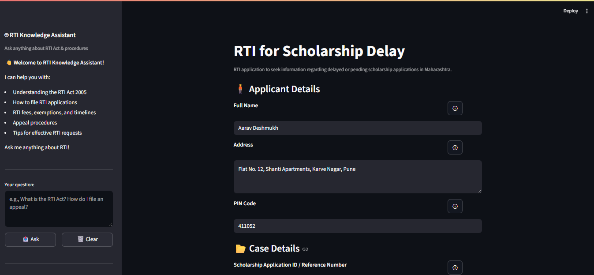
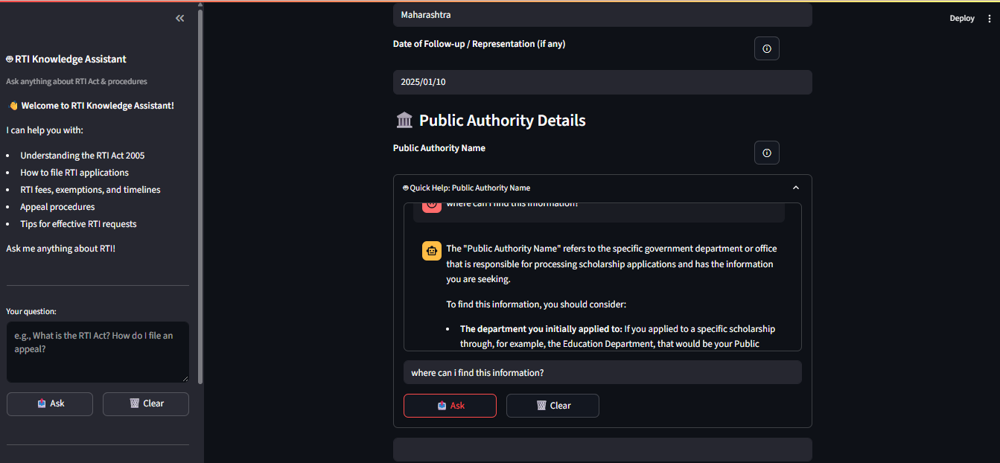
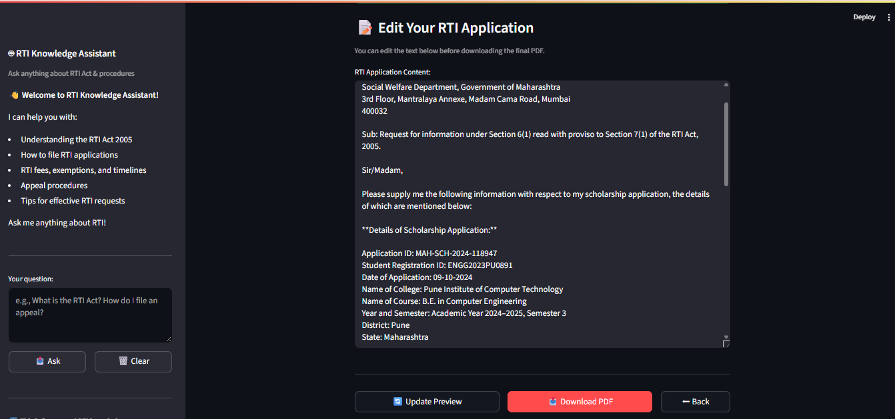
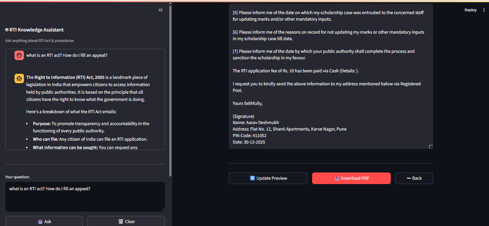

# RTI Sahayak

## 💡 The Idea

This project was developed as part of my internship, where I was given a set of predefined problem statements to choose from. I selected the following problem statement:

PS: A tool that helps citizens draft a Right to Information (RTI) application based on their query.
ML Task: Template-based generation using an LLM.
Data: Existing RTI templates and guides.
Tech Stack: OpenAI/Gemini API with a well-designed prompt, Streamlit.

Based on this, I built RTI Sahayak — an AI-assisted web application that converts a user’s natural language query into a structured, legally formatted RTI application using predefined templates and controlled LLM-based generation.

---

## 🎯 What Does It Do?

RTI Sahayak is a web app that guides you through creating an RTI application in three simple steps:

**Step 1: Search** - Describe your issue in plain English  
**Step 2: Fill** - Answer questions in a guided form  
**Step 3: Download** - Get a professional PDF ready to submit  

Plus, there's an AI chatbot that answers any questions about RTI along the way!

### Demo Workflow


*Clean landing page with semantic search*


*AI matches your query to relevant RTI templates*




*Guided form with real-time validation and AI help*


*Editable preview before downloading final PDF*


*Contextual help available throughout the process*

---

## 🛠️ How I Built It

### Design Decisions

**1. Semantic Search Over Keywords**
Instead of simple keyword matching, I used sentence transformers to understand user intent. So "my passport is delayed" automatically matches to the passport delay template even without exact keywords.

**2. Template-Based Architecture**
I designed the system to be extensible. Each RTI template is just a Jinja2 file + JSON config. Adding new templates doesn't require code changes - just configuration!

**3. Three-Stage Validation**
- **Client-side**: Real-time feedback as you type
- **Pre-submission**: Validation before generating PDF
- **Format validation**: Ensures all required fields are filled

### Technical Stack & Why I Chose It

```
Frontend: Streamlit (fast development, Python-native)
AI/ML: Sentence Transformers (semantic search) + Gemini API (chatbot)
PDF: ReportLab (Python library for PDF generation)
Templates: Jinja2 (flexible, powerful templating)
```
---
The RTI templates and guidelines used in this project were based on publicly available formats from official and community-maintained sources such as the [Right to Information Wiki](https://righttoinformation.wiki/guide/applicant/application).

## 🧠 Key Learnings

### 1. **Semantic Search is Powerful**
I initially tried keyword matching but results were poor. Switching to embeddings with cosine similarity gave much better template suggestions. Users can describe problems naturally now!

### 2. **Validation is Harder Than It Seems**
I spent a good amount of time getting validation right — deciding what validation was required and how strict it should be.

**Solution**: Created a centralized field registry with validation patterns that I can reuse across templates.

### 3. **UX Makes or Breaks It**
My first version had validation errors at the bottom of the form. Users missed them! I changed to inline validation next to each field - huge improvement.

Also learned: Progress indicators matter. The 3-stage workflow (Fill → Preview → Download) gives users a sense of progress.

### 4. **AI Integration Needs Guardrails**
The Gemini chatbot initially gave generic answers. I had to:
- Add system prompts to constrain it to RTI topics
- Include form context for field-specific help
- Handle rate limits and API failures gracefully

**Learning**: Always test with real data.

---

## 🏗️ System Architecture

### High-Level Flow
```
User Query 
  → Semantic Search (embeddings) 
    → Template Selection 
      → Dynamic Form Generation (from registry)
        → Validation 
          → Jinja2 Template Rendering 
            → PDF Generation 
              → Download
```

## 💭 Final Thoughts

RTI Sahayak was developed as part of my internship and turned into something I'm genuinely proud of. It's not perfect, there's no backend, no auth, no mobile app but it works and it helps people. It also helped me learn how to design end-to-end solutions and apply machine learning in a practical, problem-driven way.

The most rewarding moment was when a friend used it to file their first RTI about a pending ration card. They said, "I always thought RTI was for activists. This made it feel accessible."

---

*This project is open-source and available on GitHub. Contributions welcome!*
